# Architecture Diagrams

Visual reference for the **GenAI Document Assistant** capstone: components, data flows, agent graphs, and deployment topology.

Related docs:
- [ARCHITECTURE.md](ARCHITECTURE.md) — narrative architecture overview
- [CONFIGURATION.md](CONFIGURATION.md) — config and `.env` overrides
- [DOCKER.md](DOCKER.md) — local Docker Compose guide
- [RENDER.md](RENDER.md) — cloud deployment on Render

---

## 1. High-level system overview

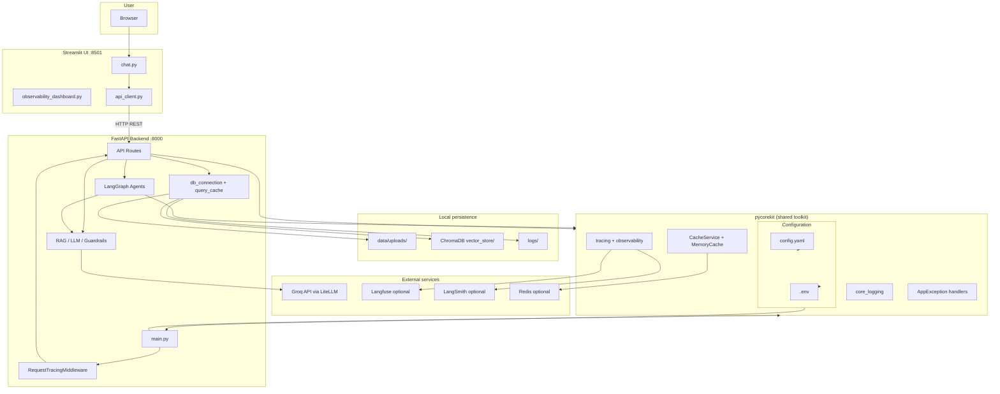

---

## 2. Backend API layer

| Endpoint | Method | Purpose |
|----------|--------|---------|
| `/health` | GET | Liveness — API is up |
| `/ready` | GET | Readiness — Chroma, embeddings, API key |
| `/upload-and-ingest` | POST | Upload + full ingestion pipeline |
| `/documents` | GET | List ingested documents |
| `/ask-question` | POST | Run query graph (may trigger HITL) |
| `/choose-document` | POST | Resume after user picks a document |
| `/observability` | GET | Observability smoke test |

Mutating and query routes use `@with_observability` and return a sanitized `observability` payload in JSON responses.

---

## 3. Configuration flow

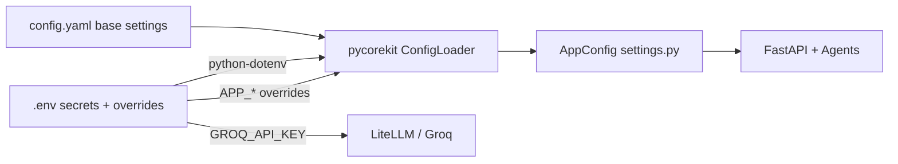

**Usage:**
- `config.yaml` — chunk size, models, paths, cache TTL
- `.env` — API keys and runtime overrides (e.g. `APP_RAG__CHUNK_SIZE=500`)

---

## 4. Document ingestion pipeline

**Trigger:** `POST /upload-and-ingest` (Streamlit sidebar or API client)

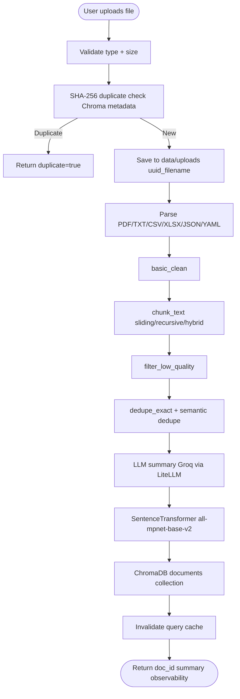

**Chroma metadata per chunk:** `doc_id`, `title`, `summary`, `filename`, `file_hash`, `chunk_index`

---

## 5. Query flow with HITL

**Trigger:** `POST /ask-question` with `{ question, thread_id }`

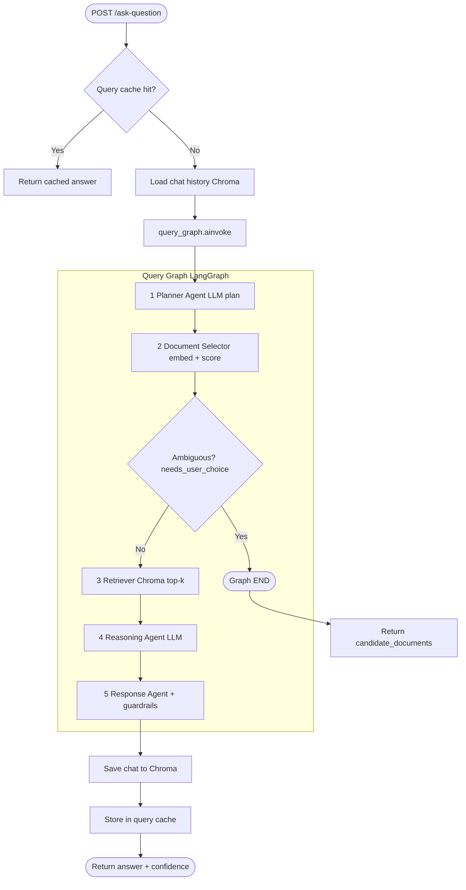

---

## 6. HITL resume flow

**Trigger:** User selects a document → `POST /choose-document`

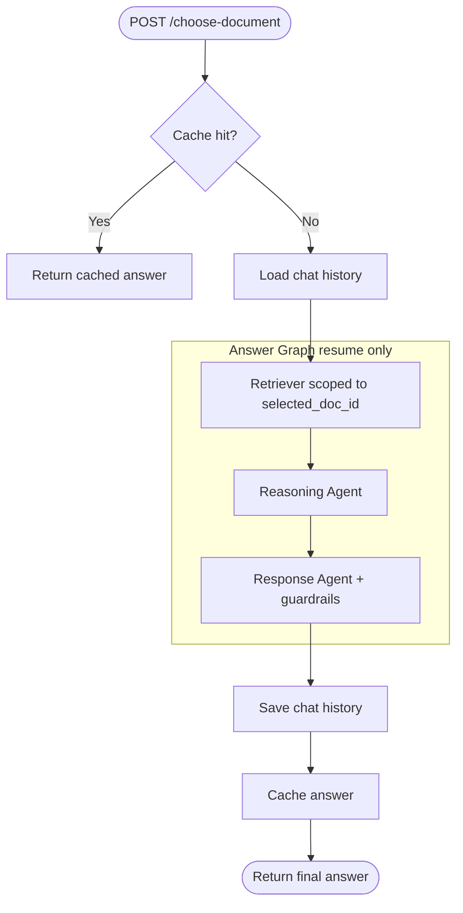

The answer graph skips planner and document selector to avoid redundant LLM calls.

---

## 7. LangGraph agent responsibilities

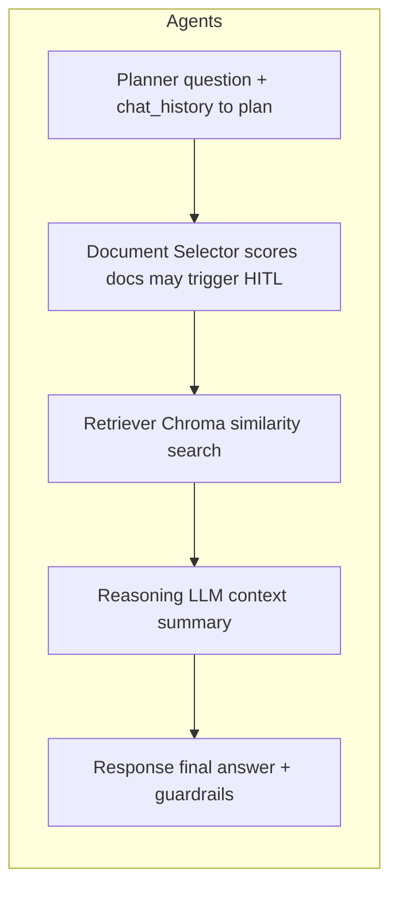

| Agent | Input | Output |
|-------|--------|--------|
| Planner | `question`, `chat_history` | `steps` (LLM plan) |
| Document Selector | `question` | `selected_doc_id` or `candidate_docs` |
| Retriever | `question`, `selected_doc_id?` | `retrieved_chunks` |
| Reasoning | chunks + history | `reasoning_summary` |
| Response | reasoning + chunks | `final_answer`, `confidence`, `hallucinated` |

---

## 8. ChromaDB collections

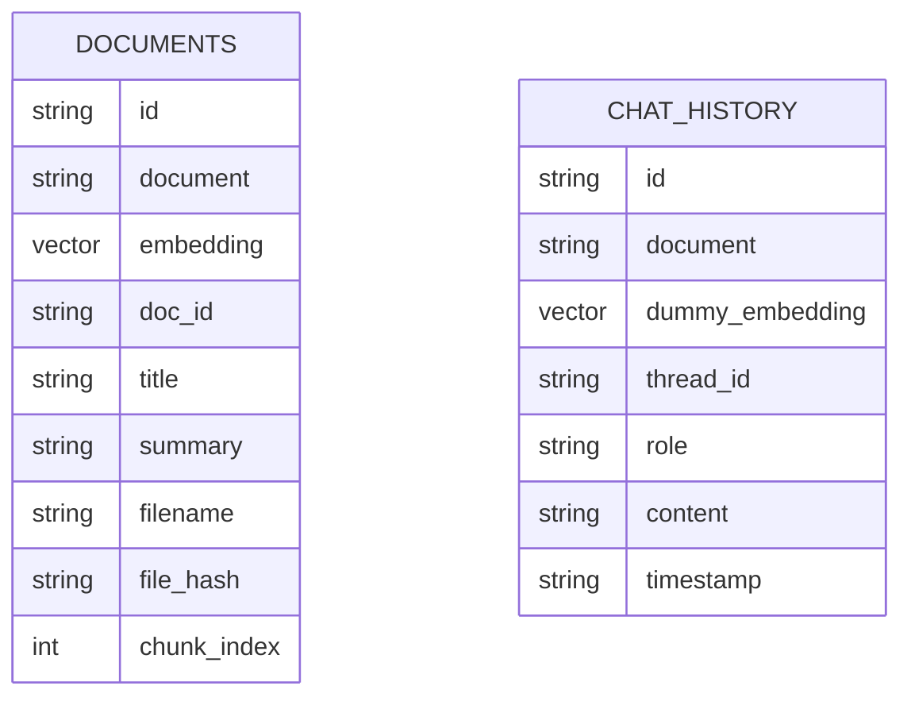

| Collection | Used for |
|------------|----------|
| `documents` | Chunk vectors + document metadata |
| `chat_history` | Per-`thread_id` conversation (dummy embeddings) |

---

## 9. pycorekit cross-cutting concerns

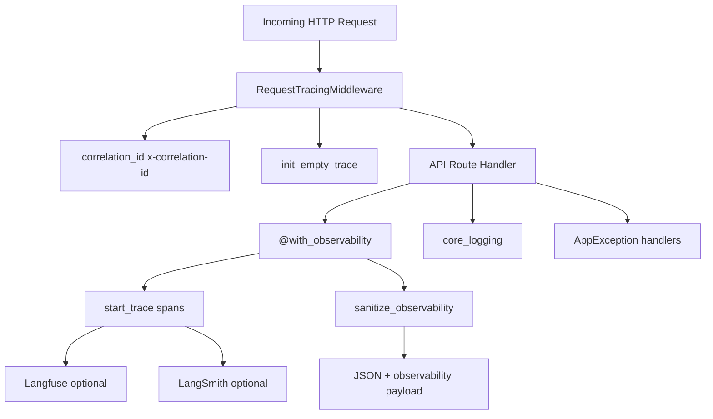

---

## 10. Streamlit UI usage map

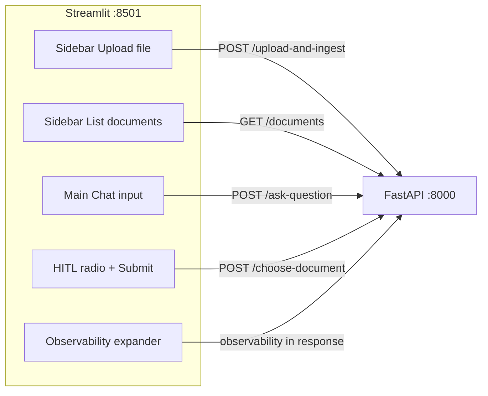

---

## 11. Project deployment artifacts

All capstone deployment files live inside `genai-doc-assistant-capstone/` (not the monorepo root):

```text
genai-doc-assistant-capstone/
├── docker-compose.yml       # Local stack (project: genai-doc-assistant-capstone)
├── docker-compose.dev.yml   # Dev overrides (hot reload)
├── render.yaml              # Render Blueprint (cloud deploy)
├── Dockerfile               # Backend image (build context = monorepo root)
├── front-end/streamlit/Dockerfile
├── .env.example
└── docs/
    ├── DOCKER.md
    └── RENDER.md
```

Docker and Render builds still use the **monorepo root** as context (`..` or `.`) because the backend image copies `pycorekit/`.

---

## 12. Docker deployment topology (local)

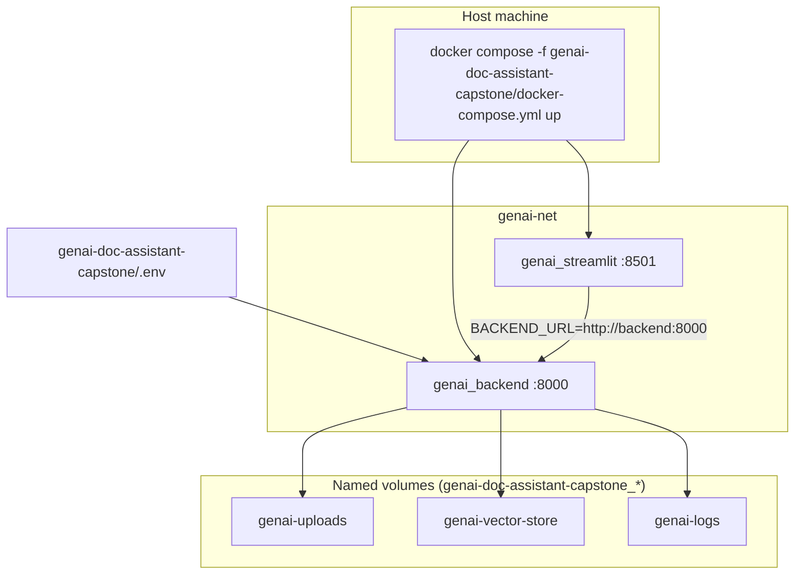

---

## 13. Render deployment topology (cloud)

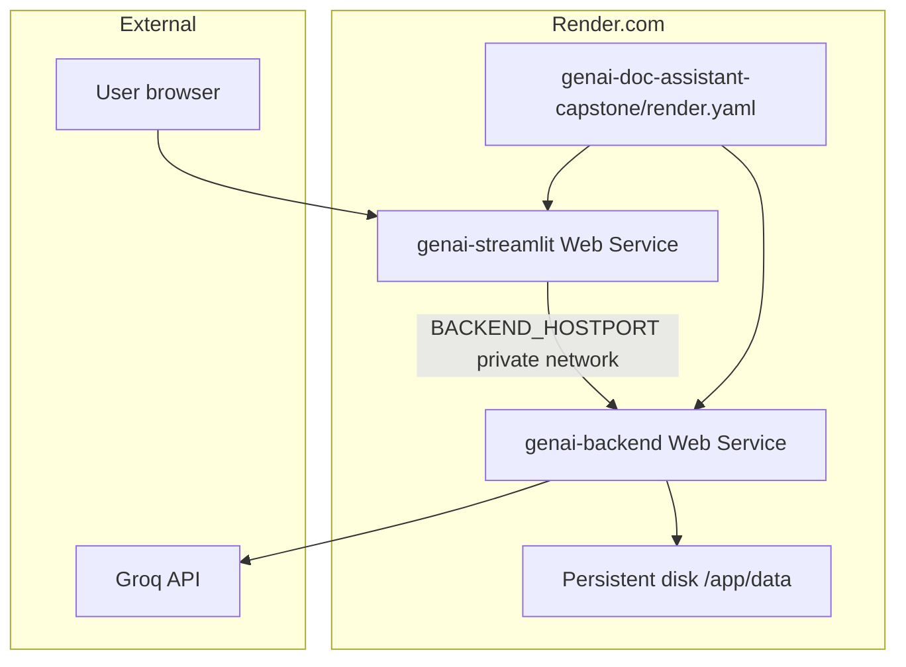

---

## 14. End-to-end user journey (sequence)

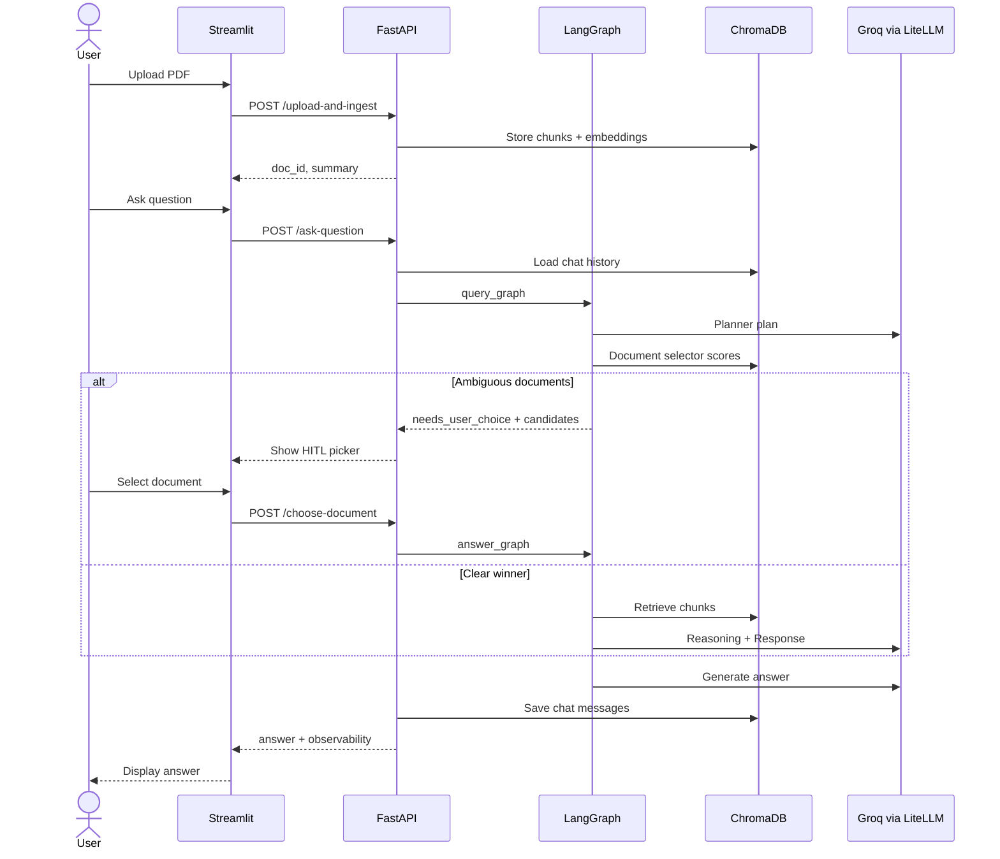

---

## 15. Component summary

| Component | Technology | Role |
|-----------|------------|------|
| Streamlit UI | Python | User interface |
| FastAPI | Python | REST API |
| LangGraph | Python | Multi-agent orchestration |
| ChromaDB | Embedded DB | Vectors + chat history |
| SentenceTransformers | Local model | Embeddings (768-dim) |
| LiteLLM | Python | LLM routing to Groq |
| pycorekit | Internal library | Logging, tracing, config, cache |
| config.yaml + .env | YAML + dotenv | Configuration |
| MemoryCache / Redis | In-process / optional | Query answer cache |

---

## Viewing these diagrams

- **GitHub** renders Mermaid blocks in this file automatically.
- **VS Code** — install a Mermaid preview extension.
- **Export to PNG/SVG** — use [mermaid.live](https://mermaid.live) or the Mermaid CLI.
