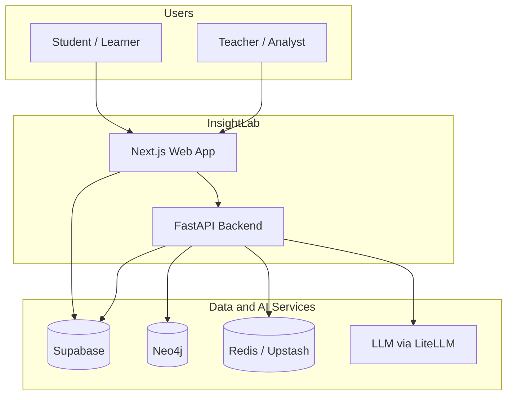
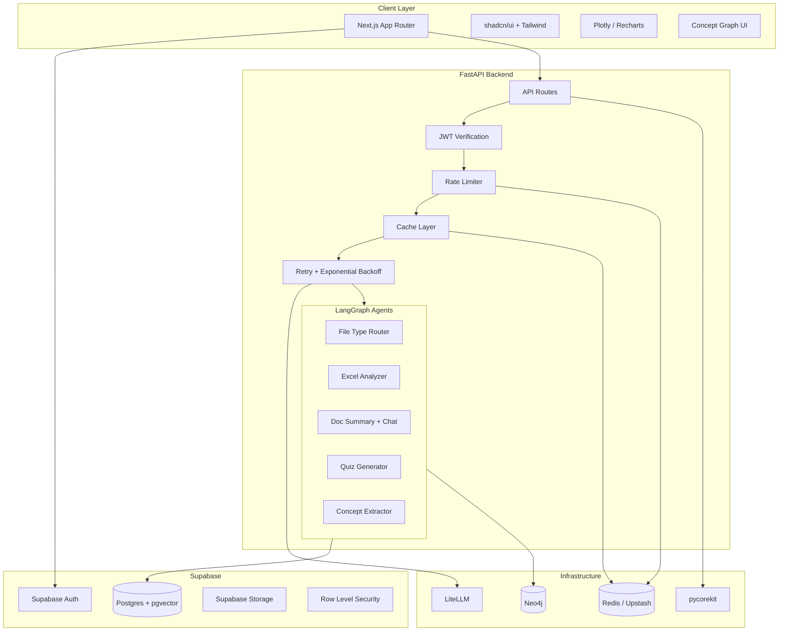
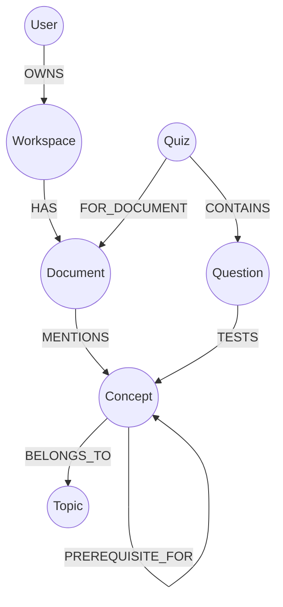
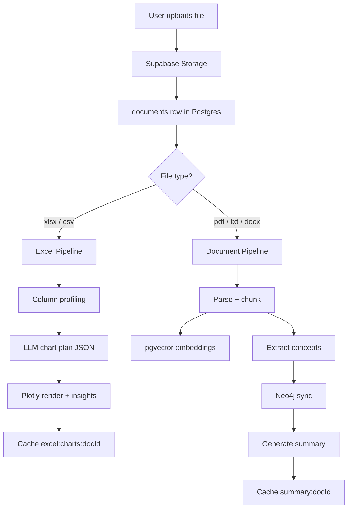
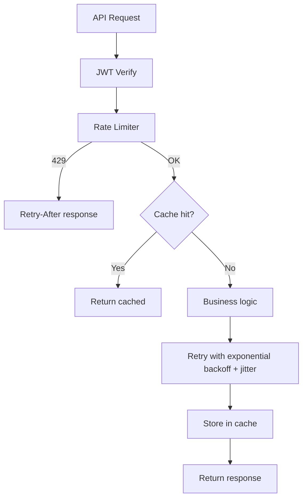
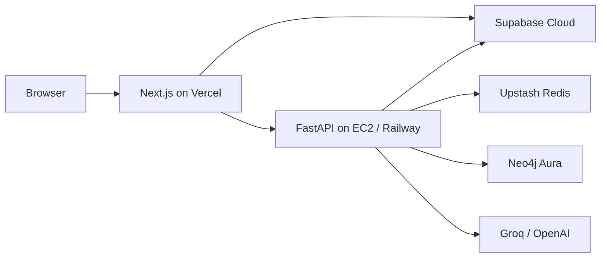

# InsightLab — System Architecture

Review document for the InsightLab platform. See [IMPLEMENTATION.md](IMPLEMENTATION.md) for live progress.

## 1. System context

## 2. Container architecture

## 3. Data ownership

| Store | Responsibility |
|-------|----------------|
| **Supabase Auth** | Identity, JWT, OAuth |
| **Supabase Postgres** | Profiles, workspaces, documents metadata, chunks + embeddings, quizzes, scores, chat |
| **Supabase Storage** | File blobs (Excel, PDF, exports) |
| **Neo4j** | Concepts, topics, relationships, quiz linkage, learning paths |
| **Redis / Upstash** | Response cache, rate limits, idempotency keys |

### Neo4j graph model

## 4. Upload routing

## 5. Frontend routes

| Route | Purpose |
|-------|---------|
| `/login`, `/signup` | Supabase Auth |
| `/dashboard` | Recent uploads and actions |
| `/workspace/[id]/upload` | File upload |
| `/workspace/[id]/excel/[docId]` | Charts and insights |
| `/workspace/[id]/document/[docId]` | Summary, chat, quiz |
| `/workspace/[id]/graph` | Neo4j concept map |
| `/settings` | Profile |

## 6. Auth flow

1. User signs in via Supabase (email or OAuth).
2. Next.js stores session (httpOnly cookies via `@supabase/ssr`).
3. Frontend sends `Authorization: Bearer <JWT>` to FastAPI.
4. Backend verifies JWT with Supabase JWKS / secret.
5. Postgres queries scoped by `user_id`; RLS enforced on direct Supabase reads.

LLM API keys never reach the browser.

## 7. Resilience layer

### Rate limits (defaults)

| Route | Limit |
|-------|-------|
| Chat | 20/min per user |
| Quiz generate | 5/min per user |
| Excel analyze | 10/min per user |
| Upload | 10/hour per user |

### Retry policy

| Operation | Max retries | Backoff |
|-----------|-------------|---------|
| LLM calls | 4 | 1s → 2s → 4s → 8s (+ jitter, max 30s) |
| Neo4j | 3 | Exponential |
| Supabase Storage | 3 | Exponential |
| 400 / 401 / 403 | 0 | No retry |

### Cache keys

| Key pattern | TTL |
|-------------|-----|
| `final_answer:{sha256}` | 24h |
| `summary:{doc_id}:{version}` | 7d |
| `excel:charts:{doc_id}:{file_hash}` | 24h |
| `quiz:{doc_id}:{settings_hash}` | 7d |
| `ratelimit:{user_id}:{route}` | window TTL |

## 8. Deployment

Local dev: `docker compose` for Redis + Neo4j; hosted Supabase project.

## 9. MVP phases

### Phase 1 — Foundation
- Supabase login
- Upload Excel + PDF
- Excel charts + insights
- Doc summary + chat
- Quiz generate (SCQ) + score
- Redis cache, rate limit, retry

### Phase 2
- Knowledge graph UI
- Teacher HITL quiz edit
- Adaptive quiz from weak concepts
- Multi-doc chat

### Phase 3
- Team workspaces
- Course pack generator
- Semantic cache
- Export PDF / LMS formats

## 10. Decisions (locked)

| Decision | Choice |
|----------|--------|
| Product name | **InsightLab** |
| License | MIT |
| Frontend | Next.js + shadcn/ui |
| Auth | Supabase Auth |
| Vectors | Supabase pgvector |
| Graph | Neo4j |
| Cache | Upstash (prod), Redis (local) |
| LLM gateway | LiteLLM |
| Backend | FastAPI + LangGraph |
| Observability | **pycorekit** (logging, tracing, exceptions) |

## 11. Backend JWT auth (implemented — Step 1.5)

```mermaid
sequenceDiagram
  participant UI as Next.js Dashboard
  participant SB as Supabase Session
  participant API as FastAPI
  participant PK as pycorekit

  UI->>SB: getSession()
  SB-->>UI: access_token (JWT)
  UI->>API: GET /me + Authorization Bearer
  API->>PK: RequestTracingMiddleware
  PK-->>API: correlation_id
  API->>API: jwt.decode (SUPABASE_JWT_SECRET)
  API-->>UI: user_id, email, correlation_id
```

Future protected routes (`/upload`, `/ask`, `/quiz`) use the same `Authorization: Bearer` header and `get_current_user` dependency.

## 12. Implementation progress

See [IMPLEMENTATION.md](IMPLEMENTATION.md) for the live feature checklist.
