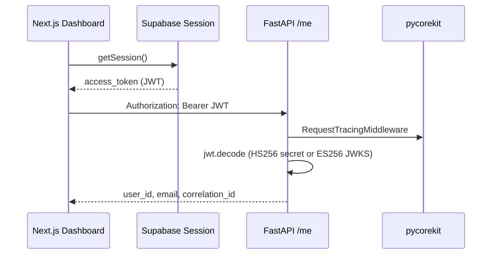

# InsightLab — Implementation Progress

Living document updated as features land. See [ARCHITECTURE.md](ARCHITECTURE.md) for system design.

## Phase 1 — Foundation

| Step | Feature | Status | Docs / endpoints |
|------|---------|--------|------------------|
| 1.0 | Repo scaffold, MIT, Docker Redis/Neo4j | Done | [README](../README.md) |
| 1.1 | Conda env (`insightlab`) | Done | [backend/README](../backend/README.md) |
| 1.2 | FastAPI health + `/ready` checks | Done | `GET /health`, `GET /ready` |
| 1.3 | Supabase schema + Storage bucket | Done | [supabase/migrations](../supabase/migrations/001_initial.sql) |
| 1.4 | Next.js auth (email + Google) | Done | [frontend/README](../frontend/README.md) |
| **1.5** | **pycorekit + JWT + `GET /me`** | **Done** | `GET /me`, dev-only Backend connection card |
| **1.6** | **File upload API** | **Done** | `POST /upload`, `GET /documents`, dashboard upload UI |
| 1.7 | Document summary + chat | Planned | `POST /ask`, `GET /summary` |
| 1.8 | Excel charts pipeline | Planned | `POST /excel/analyze` |
| 1.9 | Quiz generator | Planned | `POST /quiz/generate` |

---

## Step 1.5 — pycorekit + backend JWT (implemented)

### Backend

| Component | File | Purpose |
|-----------|------|---------|
| Logging | `pycorekit.core_logging` | Structured logs in `backend/logs/` |
| Tracing middleware | `pycorekit.tracing.middleware` | Correlation ID on every request |
| Route observability | `@with_observability` | Spans on `/health`, `/ready`, `/me` |
| Exception handlers | `pycorekit.exceptions.handlers` | Consistent JSON errors |
| JWT decode | `app/core/auth.py` | Verify Supabase access token |
| Auth dependency | `app/core/deps.py` | `Depends(get_current_user)` |
| Profile route | `app/api/routes/me.py` | `GET /me` |

### Frontend

| Component | File | Purpose |
|-----------|------|---------|
| Backend probe | `components/auth/backend-me-card.tsx` | Calls `GET /me` with session JWT |
| Dashboard | `app/dashboard/page.tsx` | Shows backend-verified user |

### Auth flow (frontend → backend)



### Install pycorekit

```powershell
conda activate insightlab
cd backend
pip install -e D:\Mine\Learining\GenAI\python\the-learning-curve-labs\pycorekit
```

### Verify

1. Start backend: `uvicorn app.main:app --reload`
2. Start frontend: `npm run dev`
3. Sign in → dashboard → **Backend connection** card shows user ID + correlation ID

### Troubleshooting `/me` returns 401

| Cause | Fix |
|-------|-----|
| **New Supabase signing keys (ES256)** | Ensure `SUPABASE_URL` is set in `backend/.env` — backend auto-fetches JWKS |
| **Legacy JWT secret (HS256)** | Ensure `SUPABASE_JWT_SECRET` matches **Settings → API → JWT Secret** |
| Wrong secret pasted | Re-copy JWT Secret; no extra spaces or quotes |
| Token expired | Sign out and sign in again |

Check token algorithm in [jwt.io](https://jwt.io): header `alg` is `HS256` or `ES256`.

---

## Environment variables (Step 1.5)

### Backend (`backend/.env`)

| Variable | Required | Purpose |
|----------|----------|---------|
| `SUPABASE_URL` | Yes | JWKS fetch for ES256 tokens + readiness check |
| `SUPABASE_JWT_SECRET` | HS256 only | Verify legacy HS256 tokens on `/me` |
| `SUPABASE_SERVICE_ROLE_KEY` | Yes | Readiness check |
| `LOG_DIR` | No | Default `logs` |
| `CORS_ALLOW_ORIGINS` | No | Default `localhost:3000` |

### Frontend (`frontend/.env.local`)

| Variable | Required | Purpose |
|----------|----------|---------|
| `NEXT_PUBLIC_SUPABASE_URL` | Yes | Auth |
| `NEXT_PUBLIC_SUPABASE_ANON_KEY` | Yes | Auth |
| `NEXT_PUBLIC_API_URL` | Yes | `http://localhost:8000` for `/me` |
| `NEXT_PUBLIC_SHOW_DEV_PANEL` | No | `true` to show backend JWT debug card |

---

## Step 1.6 — File upload (implemented)

### Backend

| Component | File | Purpose |
|-----------|------|---------|
| Supabase client | `app/core/supabase_client.py` | Service-role Storage + Postgres |
| Upload service | `app/services/upload.py` | Validate, store blob, insert `documents` row |
| Routes | `app/api/routes/upload.py` | `POST /upload`, `GET /documents` |

### Frontend

| Component | File | Purpose |
|-----------|------|---------|
| API helper | `lib/api.ts` | Bearer-authenticated fetch to FastAPI |
| Upload UI | `components/documents/file-upload-card.tsx` | Choose file + list uploads |
| Dev panel gate | `components/auth/dev-backend-me-card.tsx` | Shows `/me` card only when `NEXT_PUBLIC_SHOW_DEV_PANEL=true` |

### Allowed file types

- **Excel:** `.xlsx`, `.xls`, `.csv`
- **Documents:** `.pdf`, `.txt`, `.docx`, `.doc`

Max size: 20 MB (configurable via `UPLOAD_MAX_BYTES` in backend `.env`).

### Verify

1. Ensure Supabase Storage bucket **`uploads`** exists (private)
2. `pip install -r requirements.txt` (adds `supabase`, `python-multipart`)
3. Sign in → dashboard → **Upload files** → choose a PDF or Excel file
4. File appears in the list with status `pending`

---

## Next up — Step 1.7 Document summary + chat

- Parse uploaded documents
- Generate summary
- RAG chat with citations
