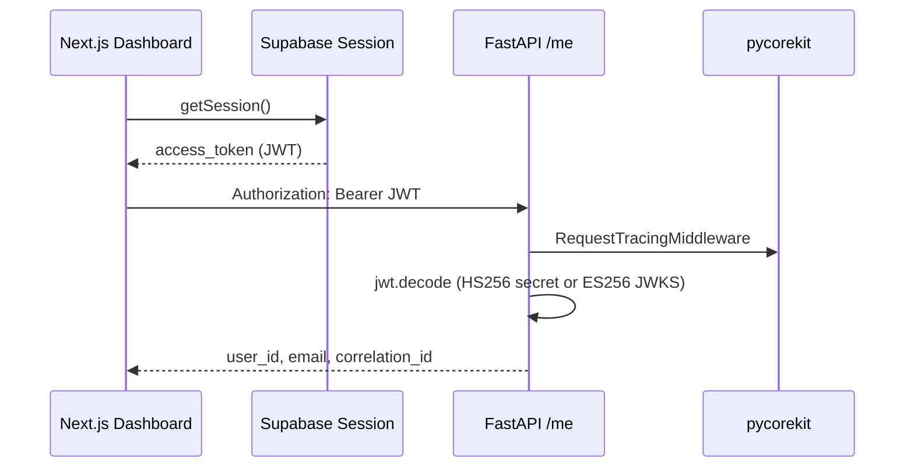
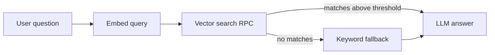

# InsightLab — Implementation Progress

Living document updated as features land. See [ARCHITECTURE.md](ARCHITECTURE.md) for system design.

> **LangGraph:** Not used in InsightLab. AI flows are implemented in `backend/app/services/` with LiteLLM + pycorekit. LangGraph appears in the sibling [genai-doc-assistant-capstone](../genai-doc-assistant-capstone/) project. See [ARCHITECTURE.md §2.1](ARCHITECTURE.md#21-ai-orchestration).

## Phase 1 — Foundation

| Step | Feature | Status | Docs / endpoints |
|------|---------|--------|------------------|
| 1.0 | Repo scaffold, MIT, Docker Redis/Neo4j | Done | [README](../README.md) |
| 1.1 | Conda env (`insightlab`) | Done | [backend/README](../backend/README.md) |
| 1.2 | FastAPI health + `/ready` checks | Done | `GET /health`, `GET /ready` |
| 1.3 | Supabase schema + Storage bucket | Done | [supabase/migrations](../supabase/migrations/001_initial.sql) |
| 1.4 | Next.js auth (email + Google) | Done | [frontend/README](../frontend/README.md) |
| **1.5** | **pycorekit + JWT + `GET /me`** | **Done** | `GET /me`, dev-only Backend connection card |
| **1.6** | **File upload API** | **Done** | `POST /upload`, `GET /documents`, dashboard upload UI |
| **1.7** | **Document summary + chat** | **Done** | `POST /process`, `GET /summary`, `POST /ask`, Redis cache |
| **1.7b** | **pgvector embeddings (RAG)** | **Done** | fastembed + `match_document_chunks` RPC, vector retrieval |
| **1.8** | **Excel charts pipeline** | **Done** | `POST /analyze`, `GET /charts`, retry + circuit breaker |
| **1.9** | **Quiz generator** | **Done** | `POST /quiz/generate`, `GET /quiz`, `POST /quiz/submit` |

---

## Step 1.5 — pycorekit + backend JWT (implemented)

### Backend

| Component | File | Purpose |
|-----------|------|---------|
| Logging | `pycorekit.core_logging` | Structured logs in `backend/logs/` |
| Tracing middleware | `pycorekit.tracing.middleware` | Correlation ID on every request |
| Route observability | `@with_observability` | Spans on `/health`, `/ready`, `/me` |
| Exception handlers | `pycorekit.exceptions.handlers` | Consistent JSON errors |
| JWT decode | `app/core/auth.py` | Verify Supabase access token |
| Auth dependency | `app/core/deps.py` | `Depends(get_current_user)` |
| Profile route | `app/api/routes/me.py` | `GET /me` |

### Frontend

| Component | File | Purpose |
|-----------|------|---------|
| Backend probe | `components/auth/backend-me-card.tsx` | Calls `GET /me` with session JWT |
| Dashboard | `app/dashboard/page.tsx` | Shows backend-verified user |

### Auth flow (frontend → backend)



### Install pycorekit

```powershell
conda activate insightlab
cd backend
pip install -e D:\Mine\Learining\GenAI\python\the-learning-curve-labs\pycorekit
```

### Verify

1. Start backend: `uvicorn app.main:app --reload`
2. Start frontend: `npm run dev`
3. Sign in → dashboard → **Backend connection** card shows user ID + correlation ID

### Troubleshooting `/me` returns 401

| Cause | Fix |
|-------|-----|
| **New Supabase signing keys (ES256)** | Ensure `SUPABASE_URL` is set in `backend/.env` — backend auto-fetches JWKS |
| **Legacy JWT secret (HS256)** | Ensure `SUPABASE_JWT_SECRET` matches **Settings → API → JWT Secret** |
| Wrong secret pasted | Re-copy JWT Secret; no extra spaces or quotes |
| Token expired | Sign out and sign in again |

Check token algorithm in [jwt.io](https://jwt.io): header `alg` is `HS256` or `ES256`.

---

## Environment variables (Step 1.5)

### Backend (`backend/.env`)

| Variable | Required | Purpose |
|----------|----------|---------|
| `SUPABASE_URL` | Yes | JWKS fetch for ES256 tokens + readiness check |
| `SUPABASE_JWT_SECRET` | HS256 only | Verify legacy HS256 tokens on `/me` |
| `SUPABASE_SERVICE_ROLE_KEY` | Yes | Readiness check |
| `LOG_DIR` | No | Default `logs` |
| `CORS_ALLOW_ORIGINS` | No | Default `localhost:3000` |

### Frontend (`frontend/.env.local`)

| Variable | Required | Purpose |
|----------|----------|---------|
| `NEXT_PUBLIC_SUPABASE_URL` | Yes | Auth |
| `NEXT_PUBLIC_SUPABASE_ANON_KEY` | Yes | Auth |
| `NEXT_PUBLIC_API_URL` | Yes | `http://localhost:8000` for `/me` |
| `NEXT_PUBLIC_SHOW_DEV_PANEL` | No | `true` to show backend JWT debug card |

---

## Step 1.6 — File upload (implemented)

### Backend

| Component | File | Purpose |
|-----------|------|---------|
| Supabase client | `app/core/supabase_client.py` | Service-role Storage + Postgres |
| Upload service | `app/services/upload.py` | Validate, store blob, insert `documents` row |
| Routes | `app/api/routes/upload.py` | `POST /upload`, `GET /documents` |

### Frontend

| Component | File | Purpose |
|-----------|------|---------|
| API helper | `lib/api.ts` | Bearer-authenticated fetch to FastAPI |
| Upload UI | `components/documents/file-upload-card.tsx` | Choose file + list uploads |
| Dev panel gate | `components/auth/dev-backend-me-card.tsx` | Shows `/me` card only when `NEXT_PUBLIC_SHOW_DEV_PANEL=true` |

### Allowed file types

- **Excel:** `.xlsx`, `.xls`, `.csv`
- **Documents:** `.pdf`, `.txt`, `.docx`, `.doc`

Max size: 20 MB (configurable via `UPLOAD_MAX_BYTES` in backend `.env`).

### Verify

1. Ensure Supabase Storage bucket **`uploads`** exists (private)
2. `pip install -r requirements.txt` (adds `supabase`, `python-multipart`)
3. Sign in → dashboard → **Upload files** → choose a PDF or Excel file
4. File appears in the list with status `pending`

---

## Step 1.7 — Document summary + chat (implemented)

### Backend

| Component | File | Purpose |
|-----------|------|---------|
| Cache | `app/core/cache.py` | pycorekit `CacheService` + rate limits |
| Document service | `app/services/document_service.py` | Parse, chunk, summarize, ask |
| Text extraction | `app/services/document_text.py` | PDF, txt, docx parsers |
| LLM client | `app/services/llm_client.py` | LiteLLM / Groq for summary + chat |
| Routes | `app/api/routes/documents.py` | Process, summary, ask endpoints |

### Frontend

| Component | File | Purpose |
|-----------|------|---------|
| Document detail | `app/dashboard/documents/[id]/page.tsx` | Auto-process + summary + chat |
| Detail UI | `components/documents/document-detail-client.tsx` | Summary, chat, retrieval method badge |

### Database

Run `supabase/migrations/002_document_chunks.sql` — adds `summary`, `processed_at`, `document_chunks` table.

### Endpoints

| Method | Path | Description |
|--------|------|-------------|
| GET | `/documents/{id}` | Document metadata + status |
| POST | `/documents/{id}/process` | Extract text, chunk, embed, summarize |
| GET | `/documents/{id}/summary` | Cached summary (Redis → Postgres) |
| POST | `/documents/{id}/ask` | RAG chat with cited chunks |

### Verify

1. Run migration `002_document_chunks.sql`
2. Set `GROQ_API_KEY` in `backend/.env`
3. Start Redis (`docker compose up -d`)
4. Upload a PDF → open document detail → auto-process → ask a question

---

## Step 1.7b — pgvector embeddings (implemented)

Semantic chunk retrieval replaces keyword-only matching when embeddings are present.

### Backend

| Component | File | Purpose |
|-----------|------|---------|
| Embeddings | `app/services/embeddings.py` | fastembed (default) or LiteLLM provider |
| Vector search | Supabase RPC | `match_document_chunks` cosine similarity |
| Config | `config.yaml` → `embeddings` | Model, dimensions, batch size, threshold |

Default model: **BAAI/bge-small-en-v1.5** (384 dimensions, local via fastembed — no extra API key).

### Database

Run `supabase/migrations/003_pgvector_embeddings.sql`:

- Enables `vector` extension
- Adds `document_chunks.embedding vector(384)` + HNSW index
- Creates `match_document_chunks(filter_document_id, query_embedding, match_count)` RPC

### Retrieval flow



Ask responses include `retrieval_method` (`vector` or `keyword`) and `chunk_similarities` when vector search succeeds.

### Verify

1. Run migration `003_pgvector_embeddings.sql`
2. `pip install -r requirements.txt` (adds `fastembed`)
3. **Re-process** documents uploaded before this migration (old chunks have no embeddings)
4. Ask a question — UI shows retrieval method; API returns `"retrieval_method": "vector"`

### Config overrides

```yaml
embeddings:
  provider: fastembed
  model: BAAI/bge-small-en-v1.5
  dimensions: 384
  similarity_threshold: 0.35
```

Env prefix: `APP_EMBEDDINGS__*` (e.g. `APP_EMBEDDINGS__SIMILARITY_THRESHOLD=0.4`).

---

## Step 1.8 — Excel charts pipeline (implemented)

### Backend

| Component | File | Purpose |
|-----------|------|---------|
| Resilience | `app/core/resilience.py` | Retry + exponential backoff + circuit breaker |
| Profiling | `app/services/excel_profiling.py` | pandas read + column profiling |
| Charts | `app/services/excel_charts.py` | LLM chart plan → chart data |
| Service | `app/services/excel_service.py` | Analyze orchestration + cache |
| Routes | `app/api/routes/excel.py` | Analyze + charts endpoints |
| LLM | `app/services/llm_client.py` | Chart plan + summary (with retry) |

### Endpoints

| Method | Path | Description |
|--------|------|-------------|
| POST | `/documents/{id}/analyze` | Profile, chart plan, insights (Excel only) |
| GET | `/documents/{id}/charts` | Cached analysis results |

### Resilience

Configured in `config.yaml` → `resilience` and `backend/.env` (`RETRY_*`):

- **Retry:** up to 4 attempts, exponential backoff with jitter (LLM + Storage)
- **Circuit breaker:** opens after 5 failures, recovers after 60s

### Database

Run `supabase/migrations/004_excel_charts.sql` — adds `excel_profile`, `excel_charts`, `excel_summary`.

### Frontend

`/dashboard/sets/[setId]/excel/[docId]` — notebook workspace; auto-analyze on open, Insights/Preview/Charts tabs, data chat.

### Verify

1. Run migration `004_excel_charts.sql`
2. `pip install pandas openpyxl`
3. Upload `.xlsx` or `.csv` → open from dashboard list
4. Charts + insights appear after analysis

---

## Step 1.9 — Quiz generator (implemented)

### Backend

| Component | File | Purpose |
|-----------|------|---------|
| Quiz parsing | `app/services/quiz_questions.py` | Validate LLM JSON quiz payload |
| Quiz service | `app/services/quiz_service.py` | Generate, fetch, score attempts |
| LLM | `app/services/llm_client.py` | `generate_quiz_draft`, `quiz_cache_key` |
| Routes | `app/api/routes/quiz.py` | Generate, get, submit endpoints |

### Endpoints

| Method | Path | Description |
|--------|------|-------------|
| POST | `/documents/{id}/quiz/generate` | LLM quiz from document chunks |
| GET | `/documents/{id}/quiz` | Latest quiz for document (no answers) |
| POST | `/quizzes/{id}/submit` | Score answers, store attempt |

### Frontend

| Component | File | Purpose |
|-----------|------|---------|
| Quiz panel | `components/documents/document-quiz-panel.tsx` | Generate, take quiz, show score |
| Document detail | `components/documents/document-detail-client.tsx` | Quiz section on document page |

### Database

Uses existing tables from `001_initial.sql`: `quizzes`, `quiz_questions`, `quiz_attempts`.

### Verify

1. Upload and process a PDF document
2. Open document detail → **Generate quiz**
3. Answer questions → **Submit answers** → see score and explanations

---

## Phase 2 — Excel data chat (implemented)

### Backend

| Component | File | Purpose |
|-----------|------|---------|
| LLM | `app/services/llm_client.py` | `answer_excel_question()`, user-scoped `excel_question_cache_key()` |
| Service | `app/services/excel_service.py` | `ask_excel()` with ownership, rate limit, cache |
| Routes | `app/api/routes/excel.py` | `POST /documents/{id}/excel/ask` |

### Security

- Ownership via `_get_owned_document()` (`owner_id = user.id`)
- Separate rate limit key `excel_chat:{user_id}` (config: `excel.chat_rate_limit_per_min`)
- Cache key includes `user_id`, `document_id`, `file_hash`, and question digest
- LLM context uses `grounded_system_prompt()` + `tag_block()`; chart series truncated via `chart_context_points`
- No raw file re-download on ask — uses stored profile, summary, and charts only
- Generic error on LLM failures (`GENERIC_EXCEL_ERROR`)

### Frontend

| Component | File | Purpose |
|-----------|------|---------|
| Chat UI | `components/excel/excel-detail-client.tsx` | Ask form + message history on Excel detail page |

### Endpoints

| Method | Path | Description |
|--------|------|-------------|
| POST | `/documents/{id}/excel/ask` | Grounded Q&A over analyzed spreadsheet |

### Verify

1. Upload and analyze an Excel or CSV file
2. Open Excel detail → **Ask this spreadsheet**
3. Ask e.g. "Which region has the highest sales?" — answer references profile/charts

---

## Next up — Phase 2 (remaining)

- [x] Excel data chat (`POST /documents/{id}/excel/ask`)
- [x] Neo4j concept graph sync (backend; UI hidden until progress-focused)
- [x] Adaptive quizzes from weak concepts + **Your progress by topic** UI
- [x] Multi-doc chat with document summaries

## Phase 2 — UX & learning (implemented)

| Feature | Backend | Frontend |
|---------|---------|----------|
| Topic mastery tracking | `GET /documents/{id}/concepts/mastery` | Progress panel after quiz submit |
| Practice weak areas | `POST /documents/{id}/quiz/adaptive/generate` | **Practice weak areas** button |
| Multi-doc chat | `/documents/multi/retrieve`, `/documents/multi/ask` | Document chat on dashboard |
| Document citations | Collapsed per-document sources | **Based on** filename list |

## Next up — Phase 3 & 4 (implemented)

### Phase 3 — Competitive shell

| Feature | Backend | Frontend |
|---------|---------|----------|
| Study Sets (workspaces) CRUD | `GET/POST/PATCH/DELETE /workspaces` | Sidebar + `/dashboard/sets` |
| Upload to study set | `POST /upload?workspace_id=` | Drag-drop upload on set page |
| Processing status | `GET /documents/{id}/status` | Processing stepper |
| Suggested questions | `GET /documents/{id}/suggested-questions` | Question chips in workspace chat |
| 3-panel document workspace | — | Sources \| Chat \| Studio notebook layout |

### Phase 4 — Study parity

| Feature | Backend | Frontend |
|---------|---------|----------|
| Flashcards | `POST/GET /documents/{id}/flashcards/*` | Flashcard study mode + Studio button |
| Study guide | `POST/GET /documents/{id}/study-guide/*` | Study guide view + Studio button |
| Source viewer | `GET /documents/{id}/chunks/{index}` | Citation drawer + quiz source excerpts |
| Quiz feedback | Source preview on wrong answers in submit | Enhanced quiz results UI |
| Set analytics | `GET /workspaces/{id}/stats` | Progress panel on set page |

Migration: `008_phase3_4_study_features.sql` (flashcards, study guides, RLS).

## Next up — Phase 5 (implemented)

| Feature | Backend | Frontend |
|---------|---------|----------|
| Compare scoped to study sets | `workspace_id` on multi-doc routes | Set picker on `/dashboard/compare` |
| Export CSV / PNG | Chart data in API responses | Client export on Excel charts |
| Audio overview | `POST/GET /documents/{id}/audio-overview/*` | Studio + browser TTS player |
| Set-wide adaptive quiz | `POST /workspaces/{id}/quiz/adaptive/generate` | `SetQuizPanel` on set detail |
| Excel notebook canvas | `GET /documents/{id}/excel/preview` | Same notebook layout as documents: sources \| chat \| Spreadsheet tools |
| Onboarding tour | — | Route-aware tour + **Show tour** in sidebar |

## Phase 6 (implemented)

| Feature | Backend | Frontend |
|---------|---------|----------|
| Course pack generator | `POST /workspaces/{id}/course-pack/generate` | `CoursePackPanel` on set detail |
| Export Anki CSV | `GET /flashcards/{set_id}/export/anki` | Anki CSV button on flashcard study |
| Export study guide PDF | `GET /study-guides/{guide_id}/export/markdown` | Export PDF (print) on study guide |
| Semantic cache | `semantic_cache.py` + document `POST /ask` | Cached badge in chat (when returned) |
| HITL quiz edit | `GET/PATCH /quizzes/{id}/edit`, `POST /publish` | Inline edit + publish in quiz panel |
| Shared study sets | `workspace_members`, invites, member RLS | Share panel + invite accept page |

Migration: `009_phase6_sharing_quiz_edit.sql` (members, invites, quiz `published`, RLS updates).

## Phase 7 (implemented)

| Feature | Backend | Frontend |
|---------|---------|----------|
| Team roles in UI | Set adaptive quiz requires editor; role on workspace API | Upload, studio, course pack, quiz generate/edit gated by `canEdit` |
| Semantic cache expansion | Multi-doc + Excel ask use embedding index | Cache match label in document, multi-doc, and Excel chat |
| Set-wide quiz HITL edit | Reuses `/quizzes/{id}/edit`, publish | Edit + publish in `SetQuizPanel` |
| Security hardening | Editor checks on mutations; migration 010; invite preview | Tour updated; invite UI without email leak |
| Remove member | `DELETE /workspaces/{id}/members/{user_id}` (owner only) | Remove button in share panel |

Migration: `010_security_hardening.sql` (RLS member insert fix, workspace chunks RPC lockdown).

## Phase 8 (implemented)

| Feature | Backend | Frontend |
|---------|---------|----------|
| Revoke pending invite | `DELETE /workspaces/{id}/invites/{invite_id}` (editor+) | Revoke button on pending invites |
| Leave workspace | `POST /workspaces/{id}/leave` (non-owner) | Leave study set in share panel |
| Delete study set UI | Existing `DELETE /workspaces/{id}` (owner, keep ≥1 set) | Delete button on set detail header |
| Invite rate limits | Preview/accept/create/member-change limits in `config.yaml` | — |
| Cache invalidation on remove/leave | `cache_invalidation.py` clears semantic indexes | — |
| Role change UI | `PATCH /workspaces/{id}/members/{user_id}` (owner) | Role dropdown in share panel |
| Deeper artifact RLS | Migration 011 member-aware SELECT/INSERT policies | — |

Migration: `011_phase8_member_rls.sql` (chunks, quizzes, flashcards, study guides, member role updates).

## Phase 8 UI — Notebook polish (implemented)

| Feature | Frontend |
|---------|----------|
| Theme + typography | DM Sans, `notebook-surface`, sidebar theme toggle |
| Notebook gallery | Study set cards with accent colors on `/dashboard/sets` |
| Document notebook | Sources rail, chat-first, `NotebookTabs`, sticky Studio, audio player bar |
| Excel notebook | Same shell; `ExcelToolsPanel`; tabs: Insights, Preview, Charts, Builder |
| Set detail | Sources strip, breadcrumbs, course pack artifact cards with tab deep links |
| Chat UX | Bubble messages, citation chips, cache labels (document, compare, Excel) |
| Compare page | Explains PDF/Word vs Excel routing; links to spreadsheet canvas |
| Onboarding tour | Route-aware steps including Excel notebook layout |

## Next up — Phase 9

- LMS export bundles (SCORM / Canvas)
- Storage read policies for workspace members (optional if all reads stay backend-only)

## Security & resilience checklist

| Control | Status |
|---------|--------|
| Supabase RLS + Storage policies (migrations 005–011) | Required in prod |
| JWT auth on all document/quiz/excel routes | Done |
| User-scoped cache keys (summary, chat, quiz, excel) | Done |
| Rate limits (upload, process, chat, quiz generate/submit, excel, sharing invites) | Done |
| Grounded LLM prompts + excerpt marker stripping | Done |
| Retry + circuit breaker on LLM/Storage | Done |
| Phase 2 migration guard (graceful degradation) | Done |
| Generic errors to clients; sanitized stored errors | Done |
